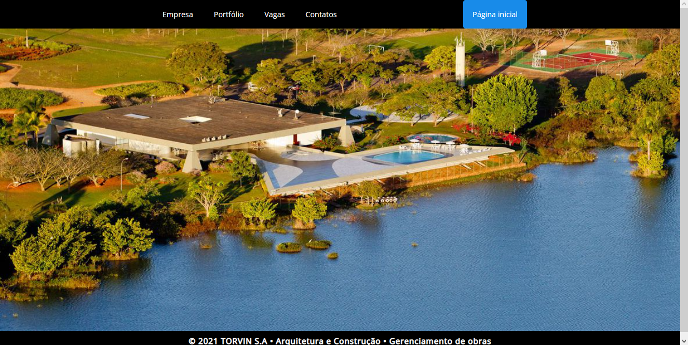
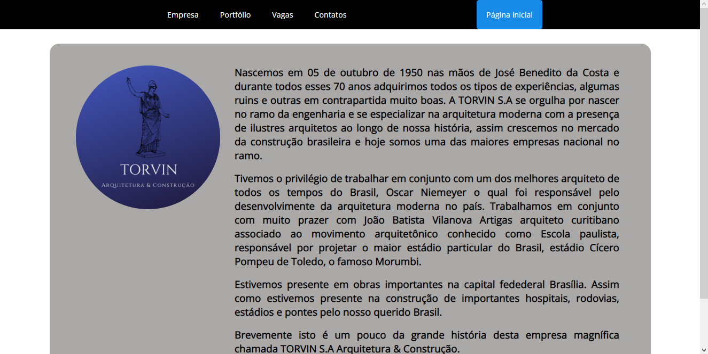
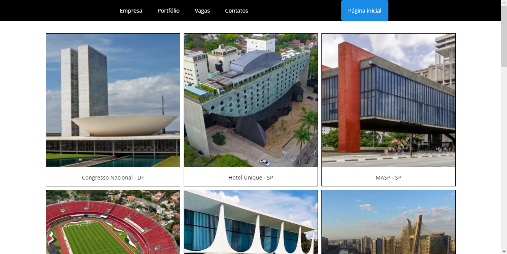
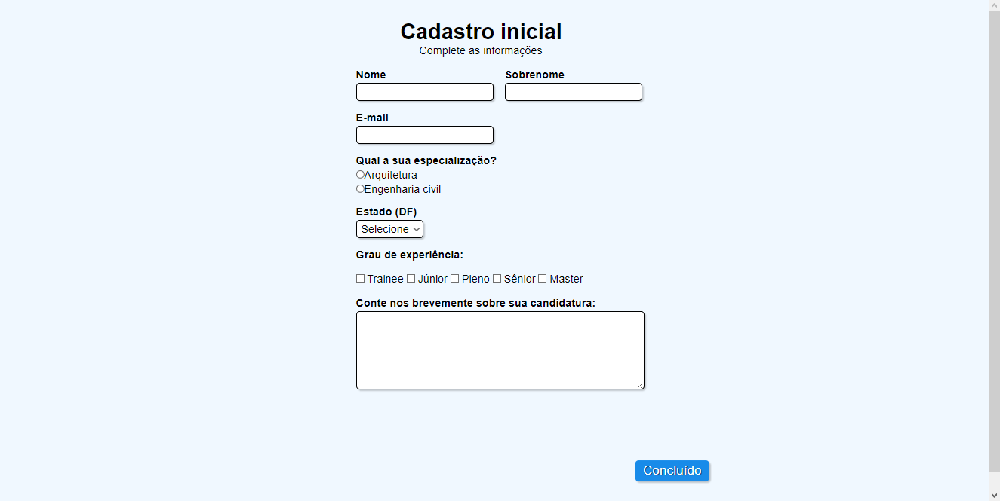
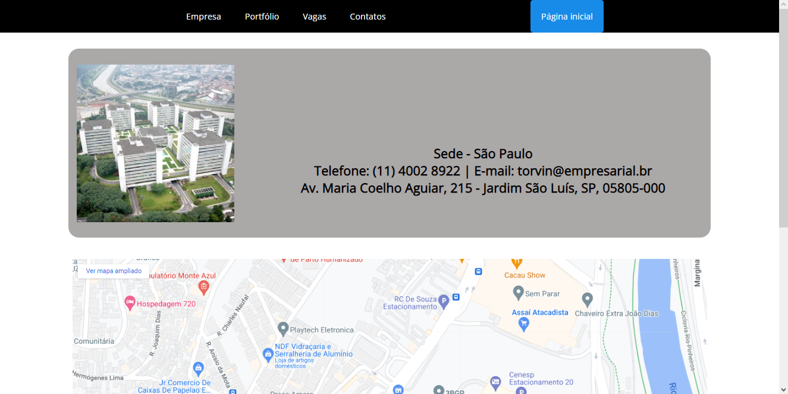

- Site livre - data 21/05/2021, por Vitor Benedito

Elementos:

- Carrossel de imagens;
- Navbar;
- Transições;
- Grid de cards;
- Formulário (sem tratamento de dados);

Projeto: 

- Página inicial

- Página Empresa

- Página Portfólio

- Página Vagas

- Página Contatos

Dificuldades enfrentadas:

Como estava no inicio dos meus estudos na programação, necessitei de auxilio com a criação da maioria dos elementos citados anteriormente, no qual foi muito útil para meu aprendizado.